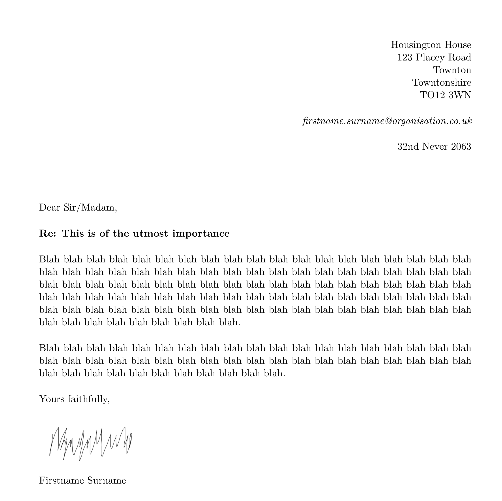

# LaTeX letter class

Simple LaTeX letter class that I put together years ago for use with `pdflatex`. Produces a nice, clean letter with address, email and date in the top right, bold subject line, block paragraph layout without indents for the body and room for a signature above your name when printed. Greetings and signoffs can be customised.

A sample letter `.tex` source file is included.

